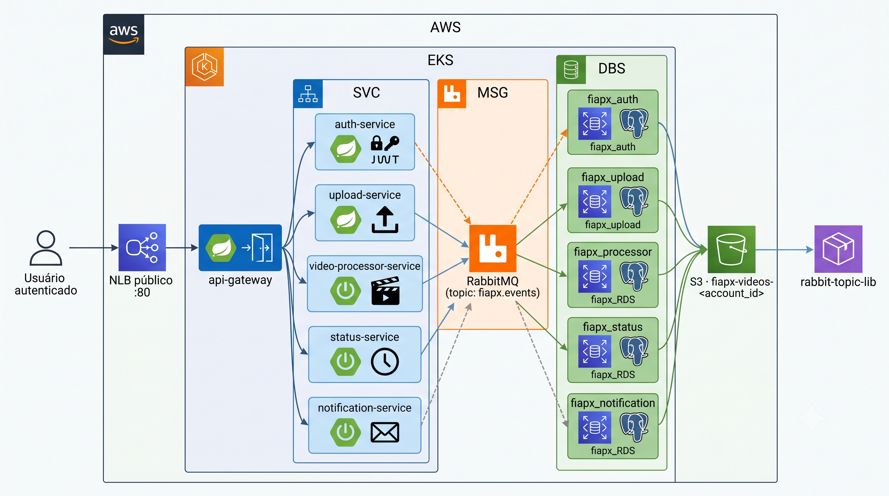

# api-gateway

Single entry point for all client requests in the FIAP-X video processing platform. Validates JWT tokens, routes requests to the appropriate microservice, aggregates Swagger/OpenAPI specs into a unified UI, and enforces CORS.



> High-level architecture of the FIAP-X platform — microservices, choreographed saga over RabbitMQ, database-per-service (RDS), object storage (S3), running on EKS and provisioned with Terraform.

---

## Tech Stack

| Technology | Version | Purpose |
|---|---|---|
| Java | 21 | Language |
| Spring Boot | 3.5.0 | Framework |
| Spring Cloud Gateway | 2025.0.0 | Reactive API Gateway (WebFlux) |
| JJWT | 0.12.6 | JWT token validation |
| SpringDoc OpenAPI | 2.8.8 | Aggregated Swagger UI |
| JaCoCo | 0.8.14 | Test coverage (minimum 80%) |
| New Relic | 8.15.0 | Monitoring/APM |
| Micrometer + Prometheus | - | Metrics |
| Docker | - | Containerization (multi-stage build) |
| Kubernetes | - | Orchestration (EKS deploy) |

---

## Architecture

Spring Cloud Gateway (reactive/WebFlux). No database. Stateless — scales horizontally.

```
src/main/java/br/com/fiapx/gateway/
├── ApiGatewayApplication.java
└── infrastructure/
    └── filter/
        └── JwtAuthenticationFilter.java   # AbstractGatewayFilterFactory
```

---

## Routes

| Route | Upstream | JWT Required |
|---|---|---|
| `/api/v1/auth/**` | auth-service:8080 | No |
| `/api/v1/uploads/**` | upload-service:8082 | Yes |
| `/api/v1/status/**` | status-service:8084 | Yes |
| `/api/v1/notifications/**` | notification-service:8085 | Yes |
| `/docs/auth-service` | auth-service `/api-docs` | No |
| `/docs/upload-service` | upload-service `/api-docs` | No |
| `/docs/status-service` | status-service `/api-docs` | No |
| `/docs/notification-service` | notification-service `/api-docs` | No |

---

## JWT Filter Behaviour

The `JwtAuthenticationFilter` runs before the request is forwarded to protected routes:

1. Reads the `Authorization: Bearer <token>` header
2. Verifies signature and expiry using the shared `JWT_SECRET`
3. On success: adds `X-User-Id` and `X-User-Role` headers, forwards the request
4. On failure (missing / malformed / expired): returns `401` immediately, never reaches the upstream service

---

## Other Endpoints

| Endpoint | Description |
|---|---|
| `GET /actuator/health` | Health check |
| `GET /actuator/info` | Application info |
| `GET /actuator/metrics` | Metrics |
| `GET /actuator/prometheus` | Prometheus-format metrics |
| `GET /swagger-ui.html` | Aggregated Swagger UI (all services) |

---

## Running Locally

### Prerequisites

- Java 21
- Maven 3.9+

No database or Docker required — the gateway is stateless.

### 1. Run the application

**Via Maven:**
```bash
cd api-gateway
mvn spring-boot:run
```

**Via IDE (IntelliJ):**
- Run the `ApiGatewayApplication` class
- No extra configuration needed (defaults in `application.yml` point to localhost)

The application starts on port **8081**.

### 2. Swagger UI (local)

Once the application is running, access the aggregated API documentation at:

> **http://localhost:8081/swagger-ui.html**

Use the **"Select a definition"** dropdown (top right) to switch between services. Only services that are running locally will load their specs — others will show an error in the dropdown.

### 3. Test with curl

```bash
# Health check
curl http://localhost:8081/actuator/health

# Public route (requires auth-service running on port 8080)
curl -X POST http://localhost:8081/api/v1/auth/login \
  -H "Content-Type: application/json" \
  -d '{"email":"useradmin@email.com","password":"Admin@12345"}'

# Protected route (requires valid JWT)
curl http://localhost:8081/api/v1/uploads \
  -H "Authorization: Bearer <TOKEN>"
```

### 4. Running with auth-service (full local flow)

```bash
# Terminal 1 — auth-service (port 8080)
cd auth-service && docker compose up -d && mvn spring-boot:run

# Terminal 2 — api-gateway (port 8081)
cd api-gateway && mvn spring-boot:run

# Terminal 3 — test login via gateway, then use token on protected routes
```

---

## Tests

```bash
mvn clean verify
```

Tests use `StepVerifier` (Project Reactor Test) to assert filter behaviour on valid, missing, malformed, and expired tokens. No external dependencies required.

JaCoCo enforces **>= 80% instruction coverage**. Coverage report: `target/site/jacoco/index.html`.

---

## Environment Variables

### Application (runtime)

| Variable | Default (local) | Description |
|---|---|---|
| `JWT_SECRET` | embedded dev key (Base64) | HS512 secret — must match all services |
| `AUTH_SERVICE_URL` | `http://localhost:8080` | auth-service base URL |
| `UPLOAD_SERVICE_URL` | `http://localhost:8082` | upload-service base URL |
| `STATUS_SERVICE_URL` | `http://localhost:8084` | status-service base URL |
| `NOTIFICATION_SERVICE_URL` | `http://localhost:8085` | notification-service base URL |

---

## CI/CD — GitHub Actions

The pipeline (`.github/workflows/ci.yml`) runs on push/PR to `main`:

1. **Build & Test** — compile, run tests, validate coverage
2. **SonarCloud** — code quality analysis (push to main only)
3. **Docker** — build and push image to GHCR
4. **Deploy** — apply to EKS cluster via `kubectl`

### Required GitHub Secrets (Settings → Secrets and variables → Actions)

| Secret | Description |
|---|---|
| `SONAR_TOKEN` | SonarCloud token for quality analysis |
| `AWS_ACCESS_KEY_ID` | AWS credential for EKS deploy |
| `AWS_SECRET_ACCESS_KEY` | AWS credential for EKS deploy |
| `AWS_SESSION_TOKEN` | AWS session token (if using temporary credentials) |
| `JWT_SECRET` | Production JWT secret key (Base64, min 32 bytes) |
| `NEW_RELIC_LICENSE_KEY` | New Relic license key for APM |

### Pipeline environment variables (already configured in workflow)

| Variable | Value |
|---|---|
| `AWS_REGION` | `us-east-1` |
| `EKS_CLUSTER` | `fiapx-cluster` |
| `SERVICE_NAME` | `api-gateway` |
| `SERVICE_PORT` | `8081` |

---

## Docker

The image uses a **multi-stage build**:
- **Stage 1 (build):** Maven + JDK 21 — compiles the project
- **Stage 2 (runtime):** JRE 21 — lightweight final image with the JAR and New Relic agent

The image is published to GitHub Container Registry (GHCR):
```
ghcr.io/<org>/fiapx-api-gateway:latest
```

---

## Kubernetes

Manifests in `k8s/`:
- `deployment.yaml` — 2 replicas, liveness/readiness probes, resource limits
- `service.yaml` — **LoadBalancer** (NLB) on port 80 → 8081 (public entry point for the platform on AWS)

Kubernetes secrets are automatically created by the pipeline from GitHub Secrets.

```bash
# Get the gateway public URL after EKS deploy
kubectl get svc api-gateway -o jsonpath='{.status.loadBalancer.ingress[0].hostname}'
```

---

## Acknowledgments

This project was developed with the assistance of [Claude](https://claude.com/claude-code) (Anthropic) as an AI pair-programming tool for code implementation, debugging, and documentation.
